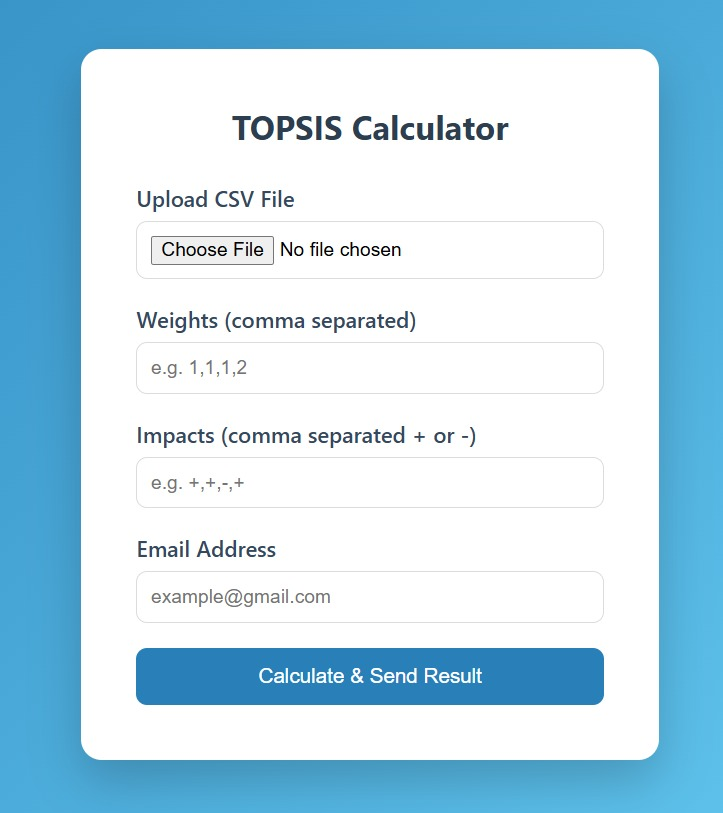
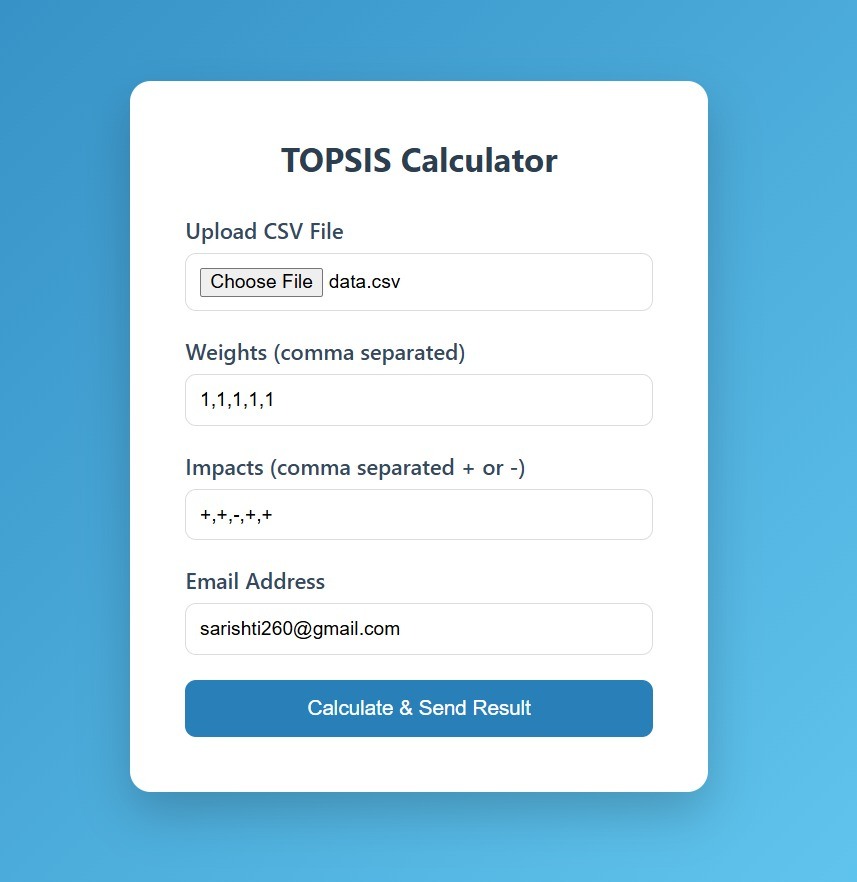
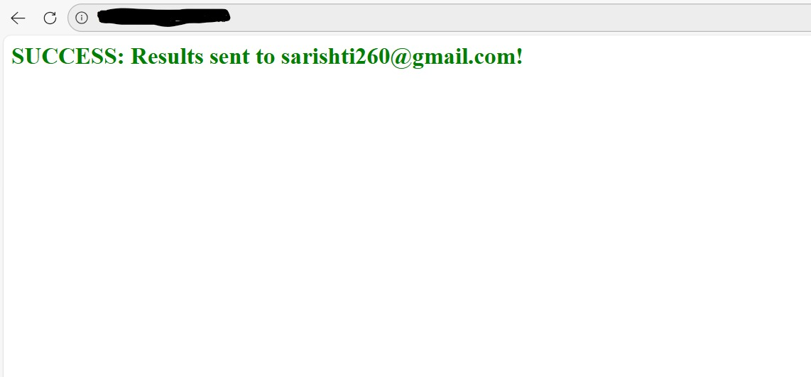

# Topsis-Sarishti-102317212

A professional Python package and web service implementing the **Technique for Order of Preference by Similarity to Ideal Solution (TOPSIS)** for Multi-Criteria Decision Making (MCDM).

---

## 1. Methodology

The project follows a structured data science pipeline to ensure accurate results and professional delivery:

1. **Data Collection**  
   Accepts CSV files containing alternatives and multiple criteria.

2. **Pre-processing**  
   - Validates minimum 3 columns  
   - Ensures all criteria columns are numeric  
   - Validates weights and impacts length  

3. **Model Application**  
   - Normalizes decision matrix  
   - Applies weights  
   - Determines ideal best and worst  
   - Calculates Euclidean distance  

4. **Result Analysis**  
   Generates:
   - TOPSIS Score  
   - Final Rank  

---

## 2. Live Links

- **PyPI Package:** [https://pypi.org/project/Topsis-Sarishti-102317212/](https://pypi.org/project/Topsis-Sarishti-102317212/1.0.0/)
- **GitHub Repository:** [https://github.com/Sarishti845/Topsis-Sarishti-102317212](https://github.com/Sarishti845/Topsis-Sarishti-102317212)

---

## 3. Features & Interface

The project provides two interfaces:

---

## 🔹 Command Line Interface (CLI)

You can run the package directly from terminal:

```bash
topsis data.csv "1,1,1,1" "+,+,-,+" result.csv
```

---

## 🔹 Web Service (Flask Based)

A modern web interface built using **Flask** that allows users to upload CSV files, enter weights and impacts, and receive the processed TOPSIS result via email.

---

### Step 1 — Homepage

Upload CSV file and enter weights, impacts, and email address.



---

### Step 2 — Form Filled

The system validates inputs and processes the TOPSIS algorithm.



---

### Step 3 — Success Message

After successful processing:

- Confirmation message is displayed  
- Result file is sent to the provided email  



---

## 4. Sample Input / Output

Example ranking output:

| Alternative | Topsis Score | Rank |
|------------|-------------|------|
| A1 | 0.534277 | 2 |
| A2 | 0.308368 | 3 |
| A3 | 0.691632 | 1 |

---

## 5. Local Setup

### Install dependencies
To run the web service locally:

- Install dependencies: pip install -r requirements.txt
- Navigate to the web_service folder.
- Run the app: python app.py

---
## 6.License
Distributed under the MIT License. Author: Sarishti Roll Number: 102317212
